## AWS Systems Manager Inventory

**Introduction**
- AWS Systems Manager Inventory offers transparency to your Amazon EC2 and on-premises processing ecosystem. We can leverage Inventory to capture metadata from your managed instances
- Metadata generated from AWS Systems Manager Inventory can be persisted in an Amazon Simple Storage Service (Amazon S3) bucket and post you can query the data and identify the version of the software and different configuration deployed in your instance as per your organization software policy, and which instances need to be updated
- You can configure Inventory on all of your managed instances by a single-click process. You can also view inventory data from multiple AWS Regions and accounts.

**Tutorial**
- In this tutorial, we will enable Inventory which uses State Manager to establish a link that runs the pre-defined document AWS-GatherSoftwareInventory on a schedule that you mention. 
- We will also configure a Resource Data Sync which sends the Inventory data to an S3 bucket for downstream processing and analysis.

1. Navigate to Systems Manager  
   
   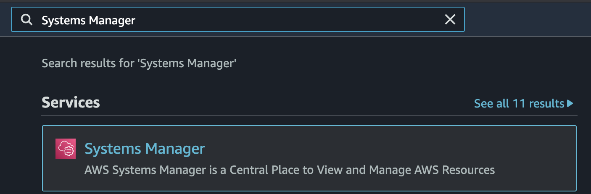

2. Select Inventory under Node Management section in the left pane
    
   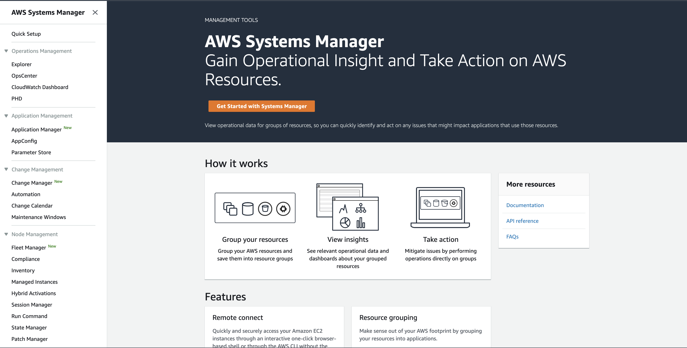

3. Select Setup Inventory from the home page
    
   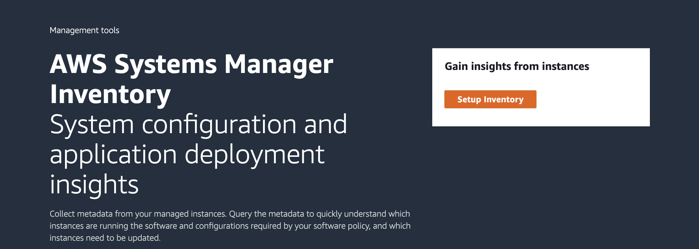

4. Enter the following for Inventory Association Configuration Details:

    - For Name keep the default: Inventory-Association
    
      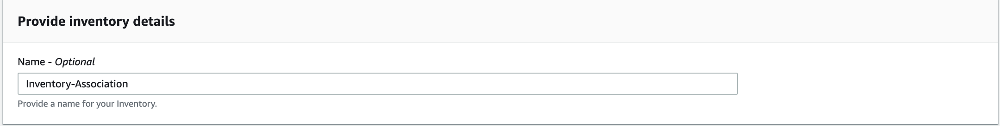

    - For Targets select Choose all instances - (You can scope the State Manager Association down to specific targets if this was a real-world scenario)
    
      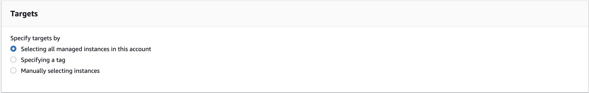

    - For Schedule keep the default of 30 minutes

      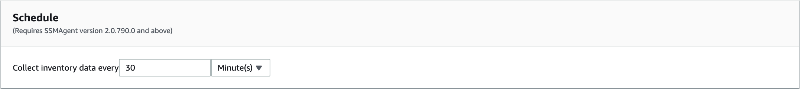

    - For Parameters keep all defaults
      
      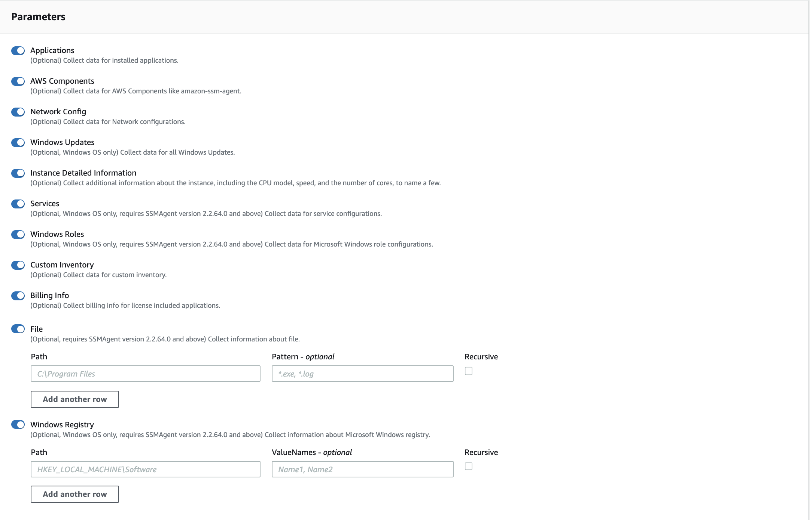

    - For Advanced leave this unchecked, we will configure this separately

      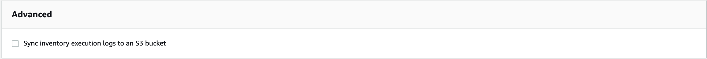

5. Select Setup Inventory

   
  
6. Select View Details (top right inside the green success banner)

     - Alternatively, navigate to State Manager and drill into the details of the Association named Inventory-Association

     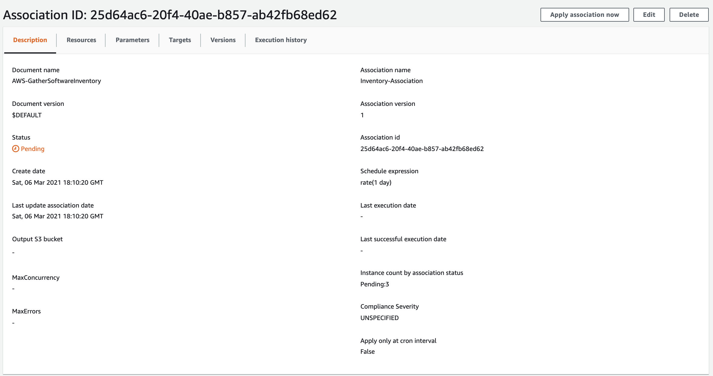

     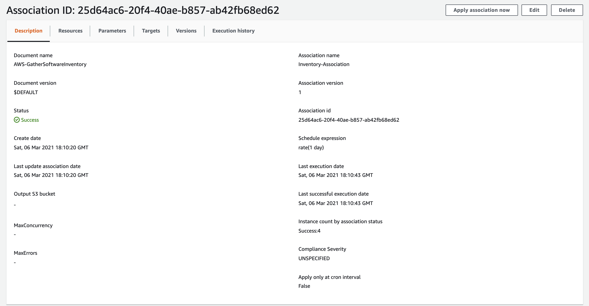

7. The Inventory Association Details will be the first place to go for troubleshooting. Traverse to resources and you will find all targets registered with the Association and a direct link to their Run Command output

8. Navigate to the Dashboard under the Inventory console

  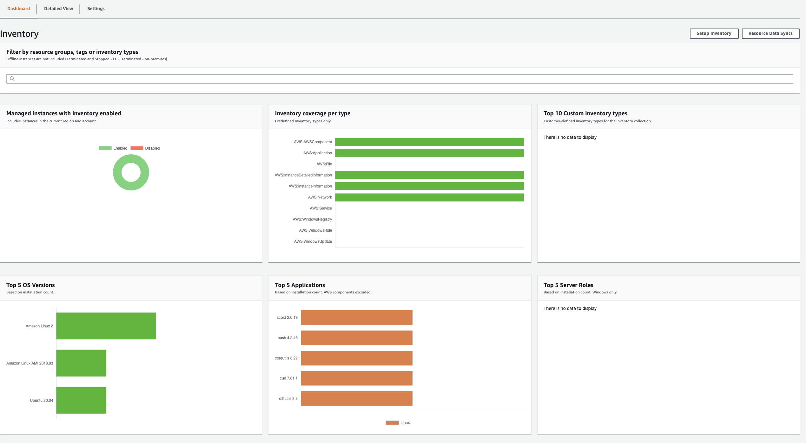

**NOTE:** It may take several minutes to begin populating data within the dashboard

9. Now we will set up the Resource Data Sync which will persist the inventory data to an S3 bucket for further processing

      - Navigate to <a href="https://console.aws.amazon.com/systems-manager/inventory"> Systems Manager > Node Management > Inventory </a>

      - Create S3 bucket for persisting resource data

      - And under Bucket Policy add below policy
   
            {
            "Version": "2012-10-17",
            "Statement": [
            {
                "Sid": "SSMBucketPermissionsCheck",
                "Effect": "Allow",
                "Principal": {
                      "Service": "ssm.amazonaws.com"
                },
            "Action": "s3:GetBucketAcl",
            "Resource": "arn:aws:s3:::ENTERYOURBUCKET"
            },
            {
            "Sid": " SSMBucketDelivery",
            "Effect": "Allow",
            "Principal": {
                       "Service": "ssm.amazonaws.com"
            },
            "Action": "s3:PutObject",
            "Resource": [
                     "arn:aws:s3:::ENTERYOURBUCKET/inventory/*"
            ],
            "Condition": {
                "StringEquals": {
                    "s3:x-amz-acl": "bucket-owner-full-control"
                   }
                 }
               }
             ]
            }
       
    **NOTE:** Enter in your Bucket Name into the policy above and select Save

    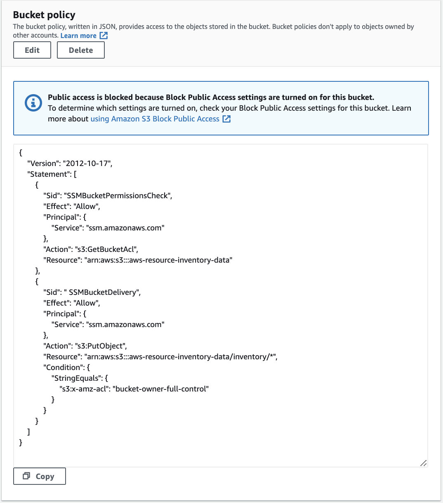

10. Navigate back to <a href="https://console.aws.amazon.com/systems-manager/managed-instances/resource-data-sync"> Inventory > Resource Data Sync </a>

11. Select Create resource data sync

    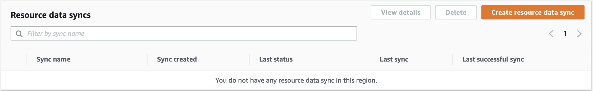
    
12. Configuration details

      - For Sync name enter YOURNAME-inventory-s3-sync

      - For Bucket name enter the name of the bucket you created previously

      - For Bucket prefix enter inventory

      - For Bucket region enter This region (us-east-1)

      - For KMS key leave this blank for the purpose of the demo - Encryption details

      - Choose Create
     
    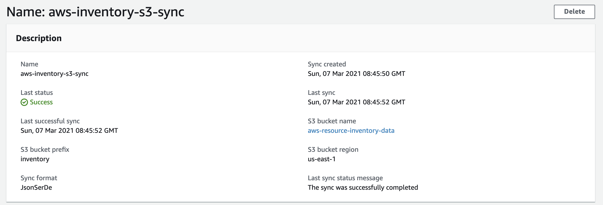  
    
    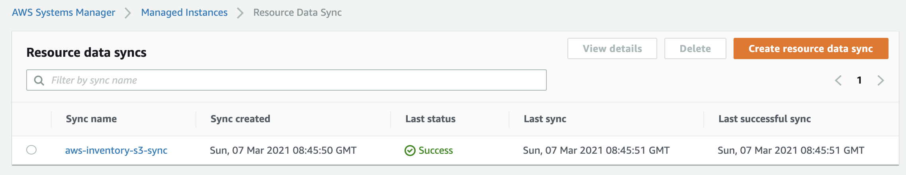  

13. Switch to your S3 bucket and you can now see the data being synced

    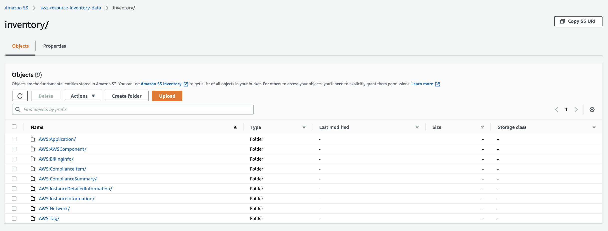  

14. Now we have a cleansed inventory persisted in the S3 bucket and with help of Athena & Quicksight, you can gain insight into the inventory data captured
